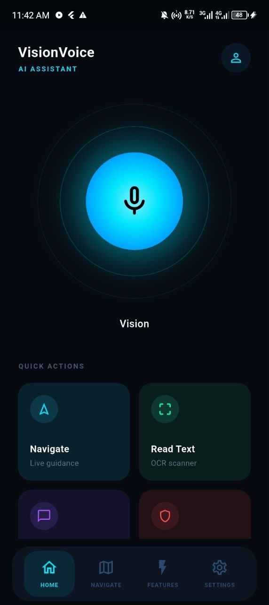
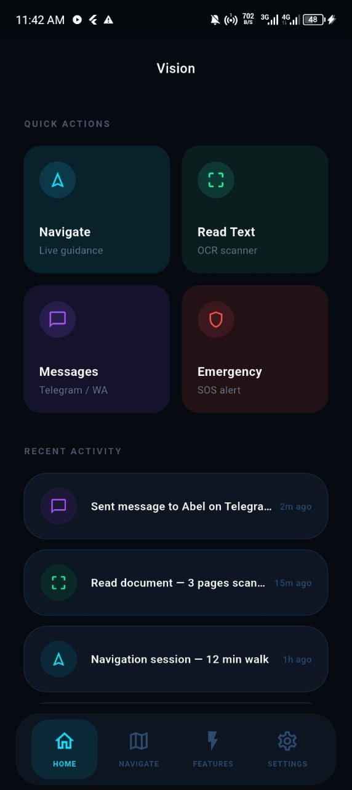
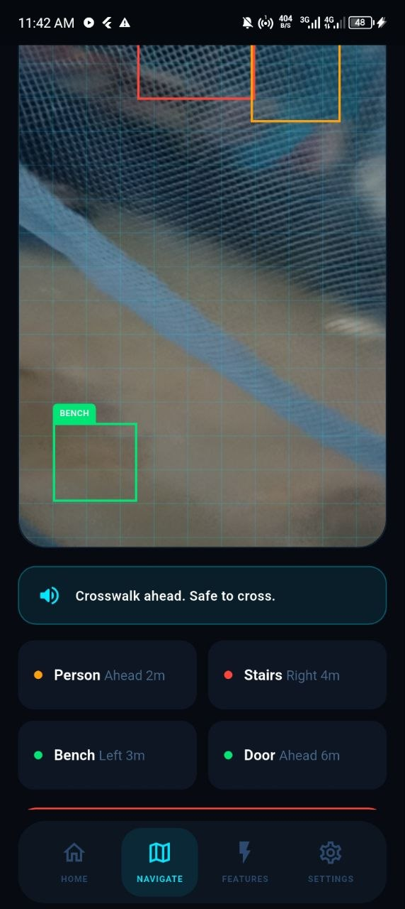
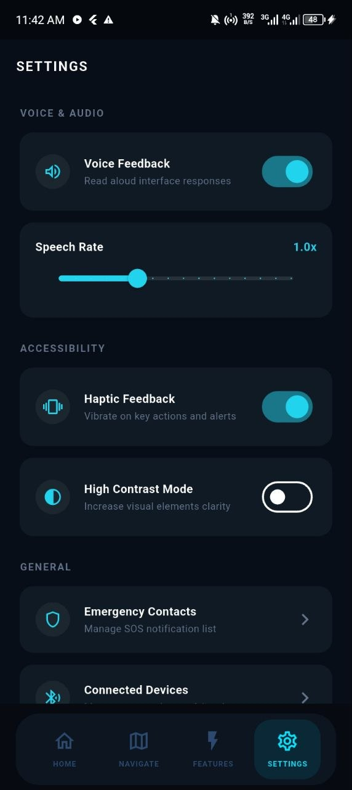

🦯 VisionVoice-AI

<table>
  <tr>
    <td align="center">
      
    </td>
    <td align="center">
      
    </td>
    <td align="center">
      
    </td>
    <td align="center">
      
    </td>
  </tr>
</table>

Voice-First AI Accessibility Assistant

  <strong>🎙️ Speak → 🧠 Understand → 👁️ See → ⚙️ Act → 🔊 Respond</strong>

📌 Project Overview

VisionVoice-AI is an AI-powered accessibility assistant designed mainly to help visually impaired users interact with computers, mobile devices, applications, and their surrounding environment.

The main idea is simple:

The user speaks naturally, and VisionVoice-AI understands the request and performs the required task.

For example:

User:
"Send a message to Moon saying hello."

        ↓

VisionVoice-AI
        ↓
Understand the command
        ↓
Open Telegram
        ↓
Find Moon
        ↓
Open the chat
        ↓
Send the message
        ↓
Tell the user the result

🎯 Main Features

🎙️ Voice Assistant

The system is designed to accept natural voice commands and convert speech into commands that the system can understand.

💬 Telegram Automation

Telegram Desktop automation is currently one of the main working parts of the project.

VisionVoice-AI can:

Open Telegram

Search for a chat

Open the chat

Send a message

Example:

"Send a message to Moon saying hello Moon."

👁️ Computer Vision

The vision system is designed to help the user understand the physical environment.

Current development includes:

📷 Camera

🎯 Object detection

👤 Face recognition

Future vision features include:

Scene description

Obstacle detection

Color detection

Currency detection

OCR

📱 Flutter Mobile Application

The project also contains a Flutter mobile application.

The mobile application is intended to provide:

Camera access

Microphone access

Voice interaction

Assistant responses

Communication with the FastAPI backend

⚙️ FastAPI Backend

The Python backend provides the main API and connects the different services together.

Main components include:

Voice
Vision
Telegram
OCR
Screen
Navigation
Automation
Reminders
Emergency

🧠 How the System Works

The overall idea is:

             👤 USER
                │
                ▼
          🎙️ Voice Input
                │
                ▼
        🗣️ Speech-to-Text
                │
                ▼
        🧠 Command Parser
                │
                ▼
        🔄 Workflow Engine
                │
                ▼
         ⚙️ Action Executor
                │
       ┌────────┼────────┐
       ▼        ▼        ▼
   Telegram   Vision   Browser
       │        │        │
       └────────┼────────┘
                ▼
          🔊 Response
                │
                ▼
              👤 USER

The important concept is:

The user describes what they want, while the system handles the technical steps.

🔄 Example: Telegram Workflow

A simple command:

"Send a message to Moon saying hello."

can become:

Voice
  ↓
Speech-to-Text
  ↓
Command Parser
  ↓
{
    "action": "telegram_send_message",
    "chat": "Moon",
    "message": "hello"
}
  ↓
Action Executor
  ↓
Open Telegram
  ↓
Search Moon
  ↓
Open Moon chat
  ↓
Send message
  ↓
Success

The project is also being developed toward a conversational workflow:

User:
"Open Telegram."

Assistant:
"Telegram is open. Who should I message?"

User:
"Moon."

Assistant:
"Moon's chat is open. What would you like to send?"

User:
"Hello Moon."

Assistant:
"Message sent successfully."

👁️ Computer Vision

The vision pipeline is:

📷 Camera
   ↓
Image Frame
   ↓
AI Vision Model
   ↓
Detection / Recognition
   ↓
🔊 Spoken Description

For example, the object detection system can detect:

person
chair
laptop
bottle
phone

Face recognition can identify known people and use confirmation/cooldown logic to avoid repeatedly announcing the same person.

🏗️ Project Architecture

VisionVoice-AI
│
├── app/
│   ├── api/
│   ├── core/
│   ├── engine/
│   ├── services/
│   │   ├── speech/
│   │   ├── tts/
│   │   ├── telegram/
│   │   ├── vision/
│   │   ├── browser/
│   │   ├── whatsapp/
│   │   ├── email/
│   │   ├── ocr/
│   │   ├── navigation/
│   │   └── emergency/
│   ├── rules/
│   ├── database/
│   └── tests/
│
├── models/
├── assets/
├── uploads/
├── logs/
├── visionvoice_ai/
│   └── Flutter mobile application
│
├── requirements.txt
├── .env
├── run.py
└── README.md

🛠️ Technologies

Python

FastAPI

OpenCV

YOLO / Object Detection

Face Recognition

PyAutoGUI

Flutter

Dart

OCR

Speech Recognition

Text-to-Speech

🚧 Current Development Status

Working / Tested

✅ FastAPI backend foundation

✅ Flutter application foundation

✅ Command parser

✅ Action executor

✅ Telegram Desktop detection

✅ Telegram Desktop launch

✅ Telegram chat search

✅ Telegram chat opening

✅ Telegram message sending

✅ Camera testing

✅ Object detection

✅ Face recognition

In Development

🔄 Conversational workflow engine

🔄 Voice-driven workflows

🔄 Mobile camera → backend vision

🔄 Speech-to-text integration

🔄 Text-to-speech integration

Planned

📋 OCR

📋 Screen understanding

📋 Navigation

📋 WhatsApp

📋 Email

📋 Currency detection

📋 Obstacle detection

📋 Emergency assistance

📸 Project Images

The project images are stored in:

images/
├── image1.jpg
├── image2.jpg
├── image3.jpg
└── image4.jpg

🚀 Installation

Clone the project:

git clone <your-repository-url>
cd VisionVoice-AI

Create a virtual environment:

python -m venv venv

Activate it on Windows:

venv\Scripts\activate

Install dependencies:

pip install -r requirements.txt

Run the backend:

python run.py

Or:

uvicorn app.main:app --reload

📱 Flutter Application

Go to the Flutter project:

cd visionvoice_ai

Install packages:

flutter pub get

Run:

flutter run

🔮 Future Goal

The long-term goal is to create one assistant that can help a visually impaired user with both digital tasks and physical-world awareness.

For example:

"What's in front of me?"
"Read this document."
"Open Telegram."
"Send Moon a message."
"Find a route to the hospital."
"Read what's on my screen."
"Who is in front of me?"

VisionVoice-AI aims to turn these requests into real actions and useful spoken responses.

❤️ Conclusion

VisionVoice-AI is being developed as a practical AI accessibility platform that combines:

🎙️ Voice
+
🧠 AI
+
👁️ Computer Vision
+
⚙️ Automation
+
📱 Mobile
+
🔊 Speech

The ultimate goal is:

Make technology easier, more natural, and more accessible for visually impaired users.

  <strong>🦯 VisionVoice-AI</strong> 
  <em>Speak. Understand. Act. Assist.</em>

